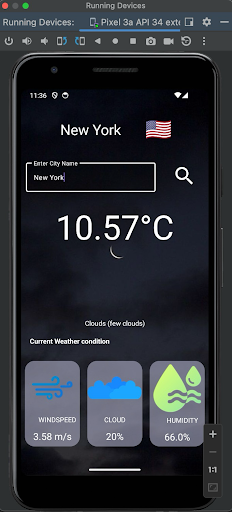
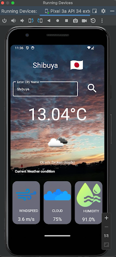
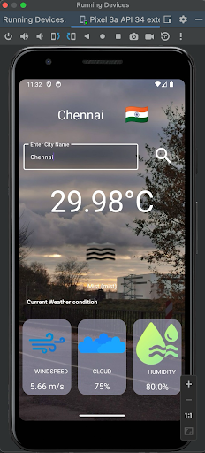
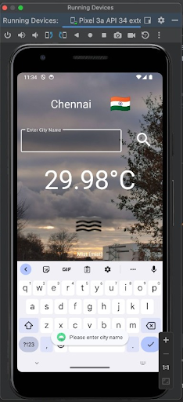
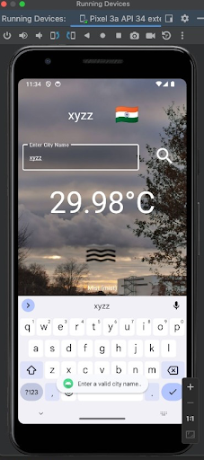

# Weather App with OpenWeatherMap API Integration
17th November, 2023

## DETAILED PROBLEM STATEMENT

The aim of this project is to create a user-friendly weather application that provides real-time weather information for a given city. The application should offer a user-friendly interface, displaying key weather metrics, such as temperature, humidity, wind speed, and more, along with historical data and relevant details. The primary goal is to create a reliable and informative weather app, enhancing the user's experience through accurate and visually appealing weather presentations.

## SOFTWARE REQUIREMENTS
### Functional Requirements

#### User Interface (UI):
User Input:
- User must be able to enable location sharing preferences (precise or approximate)
- Users can enter the name of a city in the search box. 
- Appropriate error handling for internet connectivity  issues, location permission and invalid city names. 

Weather Information Display:   
- Display the current temperature, humidity, wind speed, and weather condition for the selected city.
- Retrieve additional information such as local time and date.
- Apply the right icon and background image for the weather condition.

#### Backend:
OpenWeatherMap API Integration:
- Obtain an API key from OpenWeatherMap for authentication.
- Send requests to the OpenWeatherMap API to retrieve real-time weather data based on user input.

Data Processing
- Parse and process the JSON data received from the OpenWeatherMap API.
- Extract relevant information, including temperature, humidity, wind speed, and weather condition.

Error Handling:
- Handle API request errors gracefully and provide meaningful error messages to users.

### Non-functional Requirements
- Response Time: The system should provide real-time weather data with a response time of less than 5 seconds for optimal user experience.
- Intuitiveness: The user interface should be intuitive, ensuring that users can easily navigate and understand the weather information displayed.
- Security: Ensure secure handling of the OpenWeatherMap API key, preventing unauthorized access or usage.
- Scalability: The system should be scalable to accommodate a growing number of users without compromising performance.
- Compatibility: The application should be responsive and functional across various devices, including desktops, tablets, and mobile phones.
- Data Privacy and Compliance: Ensure compliance with data privacy regulations and safeguard user information.
- Maintenance: Write clean and well-documented code to facilitate future updates and maintenance.

## FUNCTIONALITIES
### User Input
- Users can enter the name of a city in the search field and click on the search icon to initiate the API call. 
### Weather Display Information
- Before the user inputs a city, the location of their device is displayed along with the weather information and appropriate background and icon.
- After input, current temperature, humidity, wind speed, and weather condition for the selected city are displayed.Real-time weather information provides users with up-to-date details.
### API Integration
- The system integrates with the OpenWeatherMap API to fetch weather data based on user input. The API key is securely managed for authentication.
- Parse and process the JSON data received from the OpenWeatherMap API.  Extract relevant information, including temperature, humidity, wind speed, and weather condition.

### User Experience Enhancement
- During data retrieval, loading indicators inform users that the application is fetching information.
- Background images represent the weather conditions, thus providing visual representation. 
- Flag, city, time and other relevant information are also displayed.

## SYSTEM DESIGN
### Architecture:
The WeatherApp follows a client-server architecture:
#### Frontend:
- Developed using the Android framework.
- Implements user input forms, data presentation components, and historical data visualization.
  
#### Backend:
- Makes HTTP requests to the OpenWeatherMap API.
- Processes JSON data, extracts relevant information, and handles errors gracefully.
  
#### Communication:
- Communication between the frontend and backend occurs through HTTP requests.
  
#### Security:
- API Key Handling: The OpenWeatherMap API key is securely stored on the client side.
- Data Encryption: Implement secure communication using HTTPS to encrypt data transmitted between the client and server.
  
#### Error Handling:
- User-Friendly Messages: Provide clear and user-friendly error messages in case of input errors or API failures.
- Graceful Degradation: Design the application to gracefully degrade functionality in case of partial failures.
  

## LOGIC
### Permission Logic: 
- Get permission from the user for location access.
- Handle permission denial with error messages accordingly.

### User Input Processing:
- Validate user input for city names.
- Handle cases where the entered city name may not be valid or recognized.

### API Request Logic:
- Send requests to the OpenWeatherMap API using the provided API key.
- Handle API responses, including error cases and successful data retrieval.

### Data Presentation Logic:
- Extract relevant information from the API response.
- Update the UI with the retrieved weather data.

### Error Handling Logic:
- Implement error handling mechanisms to provide a seamless user experience.
- Display meaningful error messages in case of API failures or other issues

## IMPLEMENTATION
Live Weather at different locations around the world:  

     

Errors that pop up as toasts : 

    
		
## CONCLUSION
This project aims to provide users with a reliable and visually appealing weather application. By integrating the OpenWeatherMap API, the app ensures access to accurate and up-to-date weather information. The combination of a well-designed UI and robust backend logic enhances the overall user experience, making the weather app an informative and valuable tool for users

## BEST PRACTICES:
- Code Structure: Organized code into modular components and follows coding standards for maintainability.
- Responsive Design: Ensured the application is responsive and works well on a variety of devices and screen sizes.
- Testing: Implement unit tests for critical functions and components.
- Documentation: Provide thorough documentation for both code and API usage.
- Scalability: Design the system to scale horizontally by adding more servers or instances to handle increased user loads.
- Performance Optimization: Optimize client-side and server-side code for performance. Implement lazy loading for images and components to reduce initial page load times.
- Dependency Management: Keep dependencies up-to-date and monitor for security vulnerabilities regularly.
